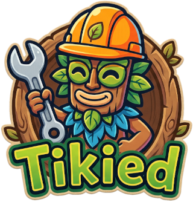

# Tikied 🔧

An editor for the game **PixelJunk™ Monsters Ultimate** worthy of Tikiman himself!



---

## 🌟 Welcome to Tikied

**Tikied** is a web-based editor and inspection tool designed for inspecting game stages, wave data, route paths, textures, and archive structures for **PixelJunk™ Monsters Ultimate**.

### Key Features
- **Archive Extraction & Inspection:** Load `.pkiwin` (index) and `.pkdwin` (data) game archives on-the-fly directly in your web browser.
- **Interactive WebGL Stage Viewer:** Render 2D stage backgrounds, trees, rocks, objects, paths, bridges, and even the water animations straight from the game.
- **Wave & Payout Data Inspector:** View detailed monster wave lists, spawn counts, coin payouts, and gem drop tables.

---

## 🛠️ Building & Running Locally

### Prerequisites
- [Node.js](https://nodejs.org/) (v20 or higher recommended)
- `npm`

### Installation & Setup

1. **Clone the repository:**
   ```bash
   git clone https://github.com/bkuhns/tikied.git
   cd tikied
   ```

2. **Install dependencies:**
   ```bash
   npm install
   ```

3. **Build the production bundle:**
   ```bash
   npm run build
   ```
   *This compiles all TypeScript files into a minified ES module bundle (`dist/main_app.js`) using Webpack + esbuild and copies static assets from `public/`.*

4. **Development mode (with source maps):**
   ```bash
   npm run build:dev
   ```

5. **Type Checking:**
   ```bash
   npm run typecheck
   ```

6. **Serve the Application:**
   You can serve the project using any static HTTP file server or by opening `index.html` directly in a modern web browser:
   ```bash
   npx serve .
   ```

---

## 📜 Disclaimer

> **Tikied is an unofficial, independent fan project and is not affiliated with, endorsed by, sponsored by, or approved by Q-Games Ltd.**

This tool does not distribute, package, or contain any copyrighted game assets, proprietary code, audio, or artwork from *PixelJunk™ Monsters Ultimate*. It is strictly an editor utility intended to parse and modify legitimately owned, local game data supplied directly by the user.

*PixelJunk™ Monsters Ultimate*, *PixelJunk*, and all associated titles, logos, characters, and assets are trademarks or registered trademarks of Q-Games Ltd. All trademarks and copyrights belong to their respective owners.

---

## 🤝 Contributing

Contributions are welcome! Please see [CONTRIBUTING.md](CONTRIBUTING.md) for build guidelines and contribution terms.

---

## 📄 License

This project is licensed under the **GNU Affero General Public License v3 (AGPLv3)**. See the [LICENSE](LICENSE) file for details.
